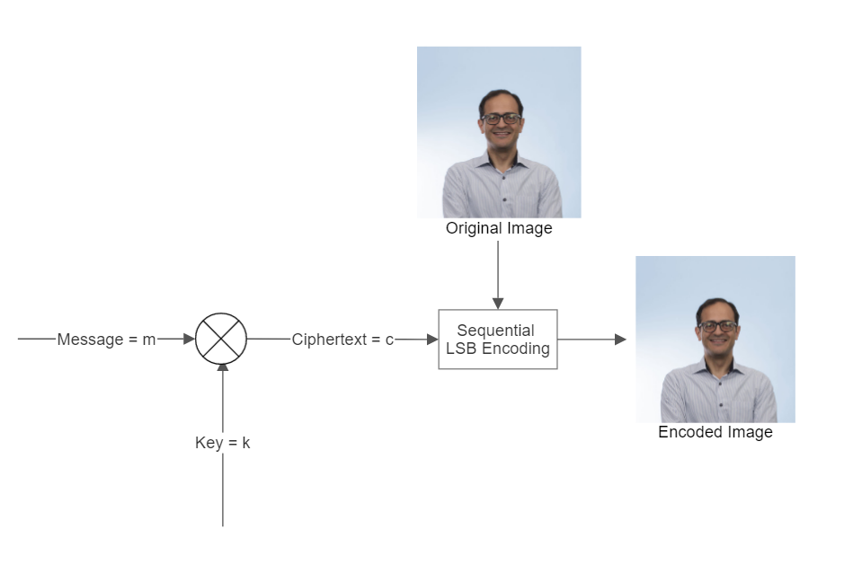
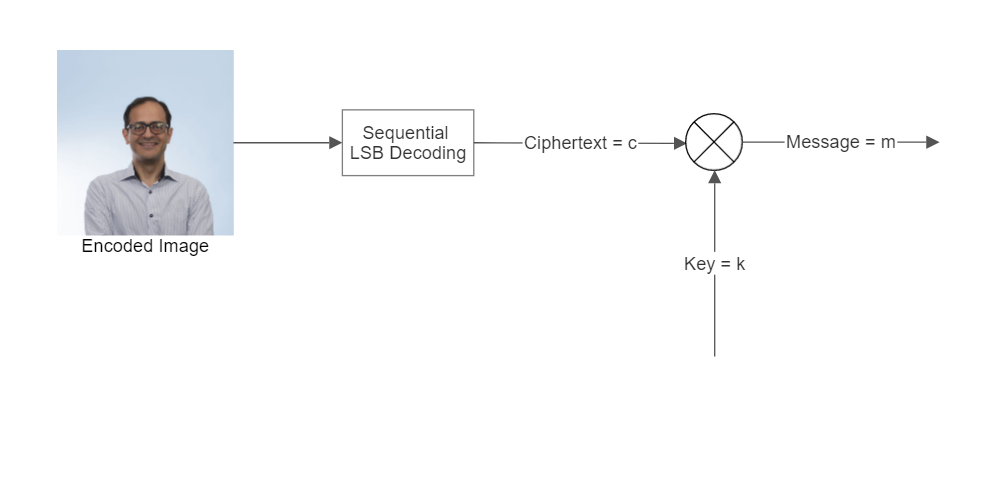

# LSB Stegonography for .png Files (EECS 475)

This program encodes and decoedes ASCII messages into .png Images using Spatial Domain Least Significant Bit (LSB) stegonography.

The encoding process first applies a One Time Pad (OTP) to the ASCII message and then encodes it using LSB into the input image. 
The program then outputs the key for the OTP and the encoded image as the file <steg.png>.


The decoding process asks for the OTP key and then outputs the decoded ASCII message to the terminal. 


This repository also contains two sample test images.
The image [steg.png]() has a hidden message encoded with the key:
```
A?:=6mZ_%6Nv,Y]$fdhIEYg
```
## Usage:

```console
$python3 Image_LSB.py <input_image> 
```

### To Encode:
```console
$python3 Image_LSB.py <image_to_encode> 
>Which Mode? 1) encode 2) decode: 1
>Please type the message your wish to encode: <ASCII_MESSAGE> 
Success! The encryption key is: <YOUR_KEY>
```

### To Decode:
```console
$python3 Image_LSB.py steg.png 
>Which Mode? 1) encode 2) decode: 2
>Please enter the encryption key: <YOUR_KEY>
```
